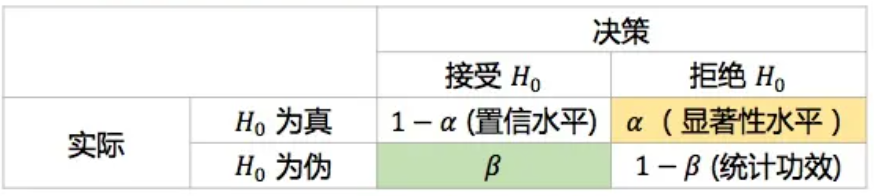
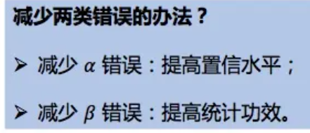
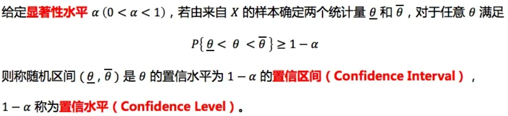
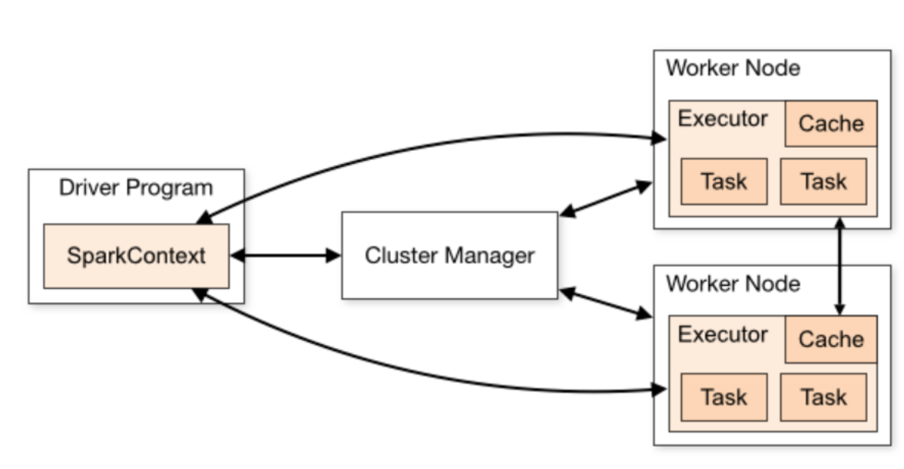
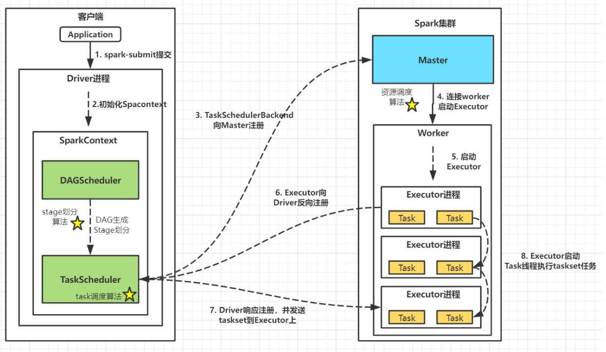
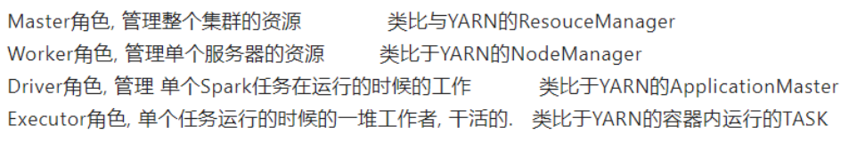
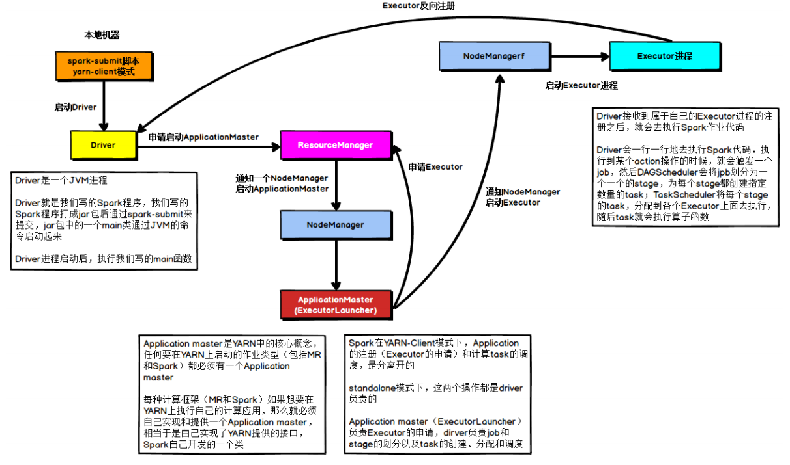
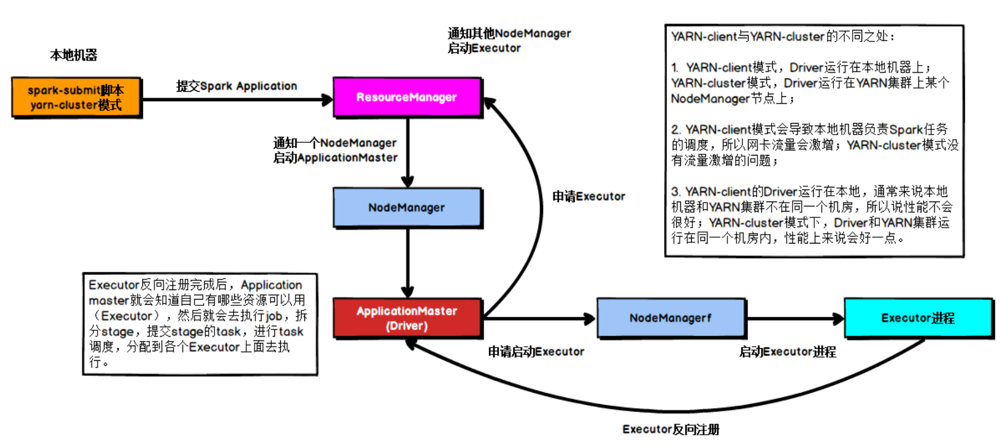
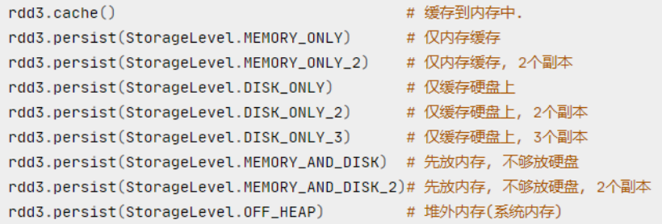

## 数据库基础知识

1. 数据库管理系统（DBMS）
2. sql中 1 = ‘1’，数字字符串会自动转成数字，而其他‘ab’如果做对比 1 = 'ab' 则会转成0
3. 索引失效如果条件中对字段进行了运算或者字段类型转换。比如，where a += 1，
4. DQL(数据查询语言)：主要用来查询数据，select语句（最常用）
   DML(数据操纵语言)：主要要来对数据中表的数据的增删改，insert、update 、delete
         INSERT INTO student (name, course,grade) VALUES ('张飞','语文',90)
         update student set grade='18' where name='关羽'
         delete from student where name='关羽'
   DDL(数据定义语言)：主要用来对数据库中表的增删改，create、drop、alter
   DCL(数据控制语言)：grant授权、revoke撤销等。
   TCL(事务控制语言)：主要用来控制事务，commint提交事务、rollback回滚事务
5. 三范式
   第一范式：数据库表原子性
   第二范式: 表必须有主键，同时其他列不能部分依赖主键。假定选课关系表为student_course(student_no, student_name, age, course_name, grade, credit)，主键为(student_no, course_name)。其中学分完全依赖于课程名称，姓名年龄完全依赖学号，不符合第二范式
   第三范式：不能存在传递依赖。假定学生关系表为Student(student_no, student_name, age, academy_id, academy_telephone)，主键为"学号"，其中学院id依赖于学号，而学院地点和学院电话依赖于学院id，存在传递依赖，不符合第三范式。
   2NF依据是非主键列是否完全依赖于主键，还是依赖于主键的一部分。
   3NF依据是非主键列是直接依赖于主键，还是直接依赖于非主键。

## Mysql

1. sql中 1 = ‘1’，数字字符串会自动转成数字，而其他‘ab’如果做对比 1 = 'ab' 则会转成0
2. 索引失效
   如果条件中对字段进行了运算或者字段类型转换。比如，where a += 1，或者where a = 1索引就会失效，走全表扫描
3. 数据类型
   <https://www.runoob.com/mysql/mysql-data-types.html>
4. 索引
   
## sql语句

1. truncate, drop, delete区别
   truncate与drop是DDL语句，执行后无法回滚；delete是DML语句，可回滚。
   truncate只能作用于表；delete，drop可作用于表、视图等。
   truncate会清空表中的所有行，但表结构及其约束、索引等保持不变；drop会删除表的结构及其所依赖的约束、索引等。
   truncate会重置表的自增值；delete不会。
   truncate不会激活与表有关的删除触发器；delete可以。
   truncate后会使表和索引所占用的空间会恢复到初始大小，drop语句将表所占用的空间全释放掉，delete操作不会减少表或索引所占用的空间。

2. row_number, rank(), dense_rank()的区别

   rank() 出现1、1、3这样的排序结果；
   dense_rank() 1、1、2这样的排序结果；
   row_number()排序相同时不会重复，会根据顺序排序。

3. ifnull(a,b)

   如果不为空则a，否则b

4. 时间处理函数
   Date 直接变成yyyy-mm-dd的形式
   timestamp(date) yyyy-mm-dd hh-mm-ss
   DATE_FORMAT(date,%m-%d-%Y)
   data_diff(dt2, dt1)
   timestampdiff(hour, dt1, dt2)
   时间戳转化
   UNIX_TIMESTAMP 转时间戳
   FROM_UNIXTIME 转时间

## 数据分析

1. 产品日活(DAU)下降，该如何分析

2. A/B测试
   
   

   显著性水平（significance level），使得犯第 Ι 类错误的概率控制在一给定的水平下，这个水平就是显著性水平，在此基础上使犯第 ΙΙ 类错误的概率尽可能小。

   p 值，在观测数据下拒绝原假设的最小显著性水平。

   

   统计功效（statistical power），不犯第ΙΙ类错误（1-β）的概率。
   A/B实验中的统计功效：当AB两组差异真的存在时，能正确判断的概率。

   

   假设检验的步骤：
   第一步：先对总体的特征作出某种假设；
   第二步：然后通过抽样研究的统计推理；
   第三步：对此假设应该被拒绝还是接受作出判断。

## sql题

1. 交换座位 184
2. 行列交换
3. 选取每组最大值数据
4. 连续登录问题

# 大数据

## hadoop

1. 各组件主要介绍
   HDFS：分布式存储，元数据记录，分块存储，副本备份
   Hive：将hdfs文件数据映射成数据库表，核心是将HQL转换为MapReduce程序，然后将程序提交到Hadoop群集执行。

2. mapreduce原理

   map：对于每个文件块根据设立分区数对相应id求出key值，并与剩下数据组成k-v对。
   mapshuffle：将数据送到缓冲区，当到达80%阈值时，将溢出数据从内存存到磁盘，并利于快排对分区内数据排序。对磁盘中所有溢出数据进行归并排序。
   reduceshuffle：reduce端对map端数据根据分区边拉取边排序，一般来说分区数是reduce的相应倍数，同样是在内存中，如果超出内存，则将文件存在磁盘中，最后将磁盘中所有数据进行归并排序。
   reduce：将数据进行合并。

## hive

1. 导入其他文件数据比如csv，必须先建一张临时表，将csv数据导入到临时表中，再创建一张其他格式表，插入。<https://blog.csdn.net/u010711495/article/details/111722382>

2. 数据倾斜

## Spark

1. Spark工作流程

   客户端提交任务，创建Driver进程并初始化SparkContext
   SparkContext向Cluster Manager申请资源
   Cluster Manager选择合适的worker节点创建executor进程
   Executor向Driver端注册，并等待其分配task任务
   SparkContext构建DAG图(有向无环图)、划分stage并分配taskset至Executor
   Executor启动Task线程执行具体任务

   
   

2. Spark架构角色和yarn的区别

   

3. Spark on client和Spark on yarn区别

   本质上就是driver运行在客户端还是在resourcemanger上。
   
   

4. Spark为什么比mapreduce快
   mapreduce只有map和reduce算子，而且一个map只能对应一个reduce串行运行。mapreduce中shuffle会频繁在内存和磁盘中交互导致缓慢。
   Spark中算子丰富，同时大多在内存中进行计算。算子形成有向无环图基于依赖关系在stage中划分内存迭代管道。

5. Sparkshuffle和mapreduce shuffle区别

6. Spark中.cache()和.persist()区别
   都是存储在缓存，cache调用了persist，cache相当于persist子集.
   

7. 缓存和持久化
   

## 数据仓库

1. 数据仓库各层作用
   ODS层：存储原始事实表，
   DWD层：
   DWS层：
   ADS层：
   DIM层：存储维度表

2. 数据仓库分层的好处
   1、清晰数据结构：每一个数据分层都有它的作用域和职责，在使用表的时候能更方便的定位和理解
   2、减少重复开发：规范数据分层，开发一些通用的中间层数据，能够减少极大地重复计算
   3、便于维护
   4、统一数据口径：通过数据分层，提供统一的数据出口，统一对外输出的数据口径
   5、复杂问题简单化：将一个复杂的任务分解成多个步骤来完成，每一层解决特定的问题
