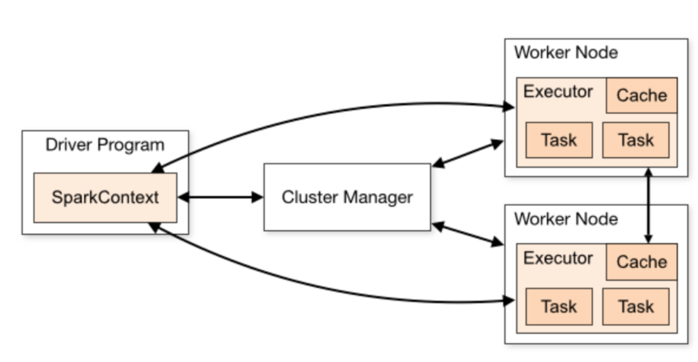
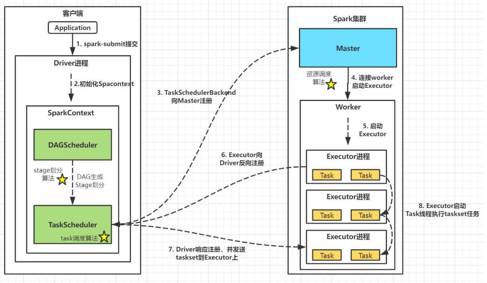
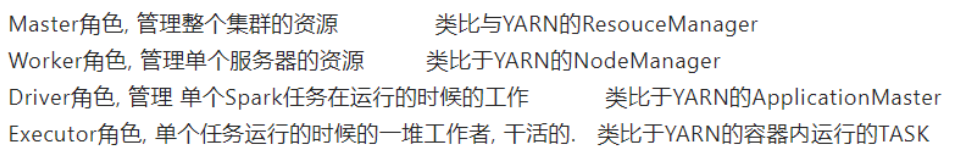
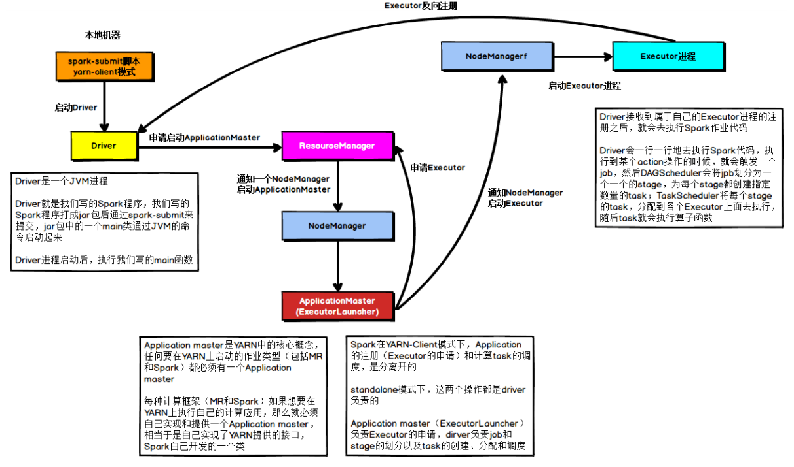
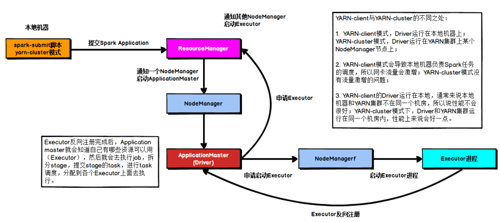
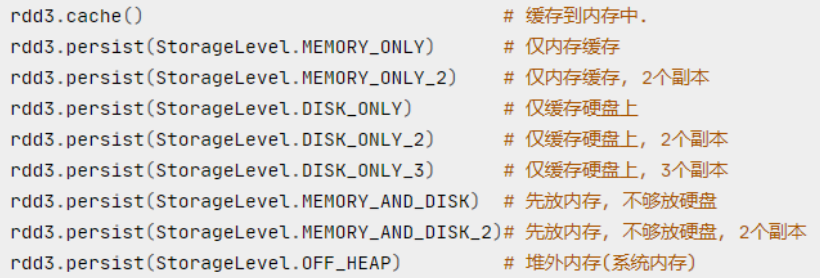
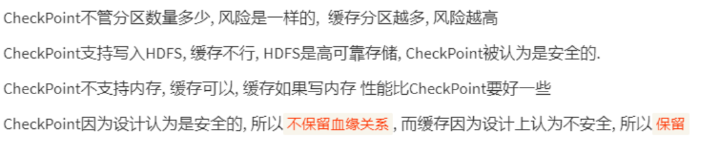

## 数据库基础知识

1. 数据库管理系统（DBMS）

## sql语句

1. truncate, drop, delete区别
   truncate与drop是DDL语句，执行后无法回滚；delete是DML语句，可回滚。
   truncate只能作用于表；delete，drop可作用于表、视图等。
   truncate会清空表中的所有行，但表结构及其约束、索引等保持不变；drop会删除表的结构及其所依赖的约束、索引等。
   truncate会重置表的自增值；delete不会。
   truncate不会激活与表有关的删除触发器；delete可以。
   truncate后会使表和索引所占用的空间会恢复到初始大小；delete操作不会减少表或索引所占用的空间，drop语句将表所占用的空间全释放掉。

2. row_number, rank(), dense_rank()的区别

   rank() 出现1、1、3这样的排序结果；
   dense_rank() 1、1、2这样的排序结果；
   row_number()排序相同时不会重复，会根据顺序排序。

3. ifnull(a,b)

   如果不为空则a，否则b

## sql题

1. 交换座位 184
2. 行列交换
3. 选取每组最大值数据

# 大数据

## hadoop

1. mapreduce原理

   map：对于每个文件块根据设立分区数对相应id求出key值，并与剩下数据组成k-v对。
   mapshuffle：将数据送到缓冲区，当到达80%阈值时，将溢出数据从内存存到磁盘，并利于快排对分区内数据排序。对磁盘中所有溢出数据进行归并排序。
   reduceshuffle：reduce端对map端数据根据分区边拉取边排序，一般来说分区数是reduce的相应倍数，同样是在内存中，如果超出内存，则将文件存在磁盘中，最后将磁盘中所有数据进行归并排序。
   reduce：将数据进行合并。

## hive

1. 导入其他文件数据比如csv，必须先建一张临时表，将csv数据导入到临时表中，再创建一张其他格式表，插入。<https://blog.csdn.net/u010711495/article/details/111722382>

2. 数据倾斜

## Spark

1. Spark工作流程

   客户端提交任务，创建Driver进程并初始化SparkContext
   SparkContext向Cluster Manager申请资源
   Cluster Manager选择合适的worker节点创建executor进程
   Executor向Driver端注册，并等待其分配task任务
   SparkContext构建DAG图(有向无环图)、划分stage并分配taskset至Executor
   Executor启动Task线程执行具体任务

   
   

2. Spark架构角色和yarn的区别

   

3. Spark on client和Spark on yarn区别

   本质上就是driver运行在客户端还是在resourcemanger上。
   
   

4. Spark为什么笔mapreduce快
   mapreduce只有map和reduce算子，而且一个map只能对应一个reduce串行运行。mapreduce中shuffle会频繁在内存和磁盘中交互导致缓慢。
   Spark中算子丰富，同时大多在内存中进行计算。算子形成有向无环图基于依赖关系在stage中划分内存迭代管道。

5. Sparkshuffle和mapreduce shuffle区别

6. Spark中.cache()和.persist()区别
   都是存储在缓存，cache调用了persist，cache相当于persist子集.
   

7. 缓存和持久化
   

## 数据仓库

1. 数据仓库各层作用
   ODS层：存储原始事实表，
   DWD层：
   DWS层：
   ADS层：
   DIM层：存储维度表
