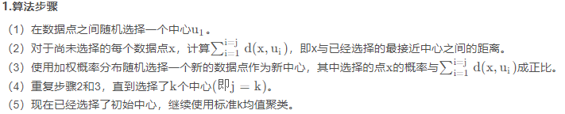

# 数据挖掘

## 1.数据处理

## 1.1 数据定性

一般分为category数据（离散数据），num数据（连续性数据）和时序数据

## 1.2 数据清洗

### 1.2.1 检索异常值

1.可以通过箱体图，画散点图

2.3sita原理寻找（zeros）

3.DBSCAN找出范围之外的离群点
一般是删除或者做变换
4.孤立森林算法
利用异常点容易被分割的特定，

### 1.2.2 检索nan值

大量空值删除
利用xgboost等模型时不做处理
插值处理

### 1.2.3 数据预处理

max-min方法归一化
zeros标准化
Label Encoder; Onehot Encoder对object变量处理

### 1.2.4 数据去冗余

### 1.2.5 特征处理

过滤式（filter）：对数据进行特征选择，然后在训练学习器，常见的方法有 Relief/方差选择发/相关系数法/卡方检验法/互信息法

包裹式（wrapper）：直接把最终将要使用的学习器的性能作为特征子集的评价准则，常见方法有 LVM（Las Vegas Wrapper）

嵌入式（embedding）：结合过滤式和包裹式，学习器训练过程中自动进行了特征选择，常见的有 lasso 回归

### 1.2.6 特征检验

显著性验证

## 1.3 度量评定

## 1.4 常用聚类算法总结

### 1.4.1 kmeans

变体：
kmeans++，比普通kmeans方法多了选初始点的方法

bi-kmeans，为了防止kmeans陷入局部最优

1.通过kmeans（k=2）将整个簇分成两类，然后计算簇内sse
2.将sse大的簇再分成两个类再计算sse
3.直到分成k个类

### 1.4.2 层次聚类

### 1.4.3 DBSCAN（Density-Based Spatial Clustering of Applications with Noise）

### 1.4.4 FCM

根据限定条件随机赋予初始化隶属度，将上述公式求导求得最小时隶属度和类中心的公式，反复迭代计算最终确定隶属度和类

### 1.4.5 Affinity Propagation

### 1.4.6 OPTICS算法

### 1.4.7 聚类k数确定

在轮廓系数法中，

## 1.5 决策树模型

### 1.5.1 ID3

利用信息增益作为分裂标准

### 1.5.2 C4.5

利用信息增益率作为分裂标准

### 1.5.3 CART

利用基尼指数作为分裂标准

### 1.5.4 GBDT

使用CART树作为基学习器，利用负梯度作为残差拟合下一次结果

### 1.5.5 XGBoost

利用泰勒公式二阶导，求出目标函数和叶子节点值，每次使用目标函数作为分裂标准，并利用正则项限制树生长。

### 1.5.6 Lightgbm

直方图：优化特征分裂次数，将特征化为几个集合分裂
GOSS：单边梯度下降
互斥捆绑法：将互斥特征捆绑达到降维的目的

## 1.6 数据可视化分析

seaborn

显示中文
plt.rcParams['font.sans-serif'] = ['SimHei', ]
plt.rcParams['axes.unicode_minus'] = False

## 1.7 度量评判
