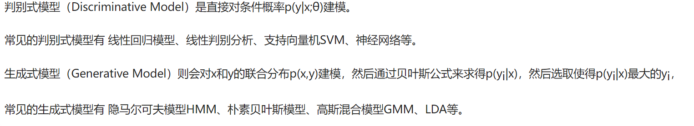

# 知识点

## 1.神经网络

### 1.1 什么是梯度爆炸（Gradient Explosion）和梯度消失（Gradient Vanishing）

**概念**：
梯度爆炸指的是在反向传播过程中，神经网络的权重更新梯度变得非常大，迅速增加，导致权重值快速膨胀。这可能会导致权重变得非常大，使网络不稳定，难以收敛。

**出现情况**：

深层神经网络，特别是当网络层数非常深时。不恰当的权重初始化，如过大的初始权重值。使用具有激活函数（如Sigmoid）的层，这些函数在某些区域的导数非常大。

**概念**：

梯度消失指的是在反向传播过程中，神经网络的权重更新梯度变得非常小，接近于零，导致权重几乎不会更新，从而网络无法学习到有效的表示。

**出现情况**：

深层神经网络，尤其是当使用具有饱和激活函数（如Sigmoid和Tanh）的层时。饱和激活函数的导数在输入接近饱和区域时非常接近零。长时间的反向传播路径，使得梯度逐渐减小。

**解决方法**
解决梯度爆炸和梯度消失问题的方法包括：

权重初始化：使用适当的权重初始化方法，如Xavier初始化（也称为Glorot初始化）或He初始化，有助于缓解梯度爆炸和消失问题。

激活函数选择：选择合适的激活函数，如ReLU（Rectified Linear Unit），Leaky ReLU，或者ELU，它们在梯度传播时更加稳定，不容易出现梯度消失问题。

批标准化（Batch Normalization）：批标准化可以帮助在训练过程中维护梯度的稳定性，减少梯度爆炸和消失的风险。

梯度裁剪（Gradient Clipping）：梯度裁剪是一种技术，可以限制梯度的大小，防止梯度爆炸。

使用更深或更浅的网络：有时，通过减少或增加神经网络的深度，可以减轻梯度爆炸和消失问题。

注意力机制（Attention Mechanisms）：注意力机制允许模型更有效地捕捉长距离依赖关系，减少梯度消失问题。

## 1.2

## 2.生成模型和判别模型的区别

